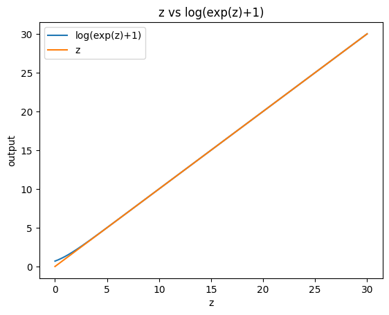
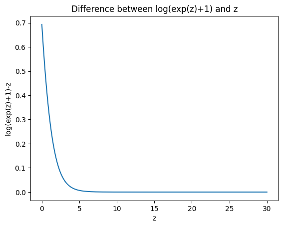

This directory contains my implementation of logistic regression. You can view the model [here](../models/logistic_regression_model.py). I started by [applying my model to 4 toy datasets](toy_datasets_logistic_regression.ipynb). Lastly, I used it to [predict whether a patient has diabetes based on several key features](diabetes_prediction.ipynb). 

This project started with me goofing around in a colab notebook, and turned out to be a very interesting lesson in how to derive numerically stable forms of sigmoid and cross entropy (resistant to overflow and underflow). Who would've thought I'd be back to doing algebra by hand?

I started with the standard formulas for sigmoid and binary cross entropy as follows:

$$
\sigma(z) = \frac{1}{1 + e^{-z}}
$$

and 

$$
L(y, \hat{y}) = -y \log(\hat{y}) - (1-y) \log(1-\hat{y})
$$

However, when trying to optimize, I continually ran into errors. I assumed it had something to do with the gradients being too high, so I tried to clip them.

However, the problem persisted. It took me a lot of plotting and analyzing gradient and output values to realize what was happening: my model was producing outputs that were so confident (high logits with y-hats very close to 0 or 1) that numerical precision error was kicking in, and I was ending up either dividing by 0, taking the log of 0, or simply with +/- infinity courtesy of e^(-z).

To solve this problem, I obtained the following derivation which combines binary cross entropy and sigmoid to create a version that takes raw logits (z) as its input (yeah, I could have just looked it up, but what would that teach me...):

$$
L(y, z) = \log(e^{z}+1) - yz
$$

This derivation is useful because it allows us to circumvent the risk of taking log(0). Additionally, we can avoid overflow from $e^{z}$ by approximating $\log(e^z +1) - yz$ as follows:

$$
L(y, z) = 
\begin{cases} 
\log(e^{z}+1) - yz & \text{if } z \leq 20 \\
z(1-y) & \text{if } z > 20
\end{cases}
$$

We can visualize why $z$ is a good approximation of $\log(e^{z}+1)$ for sufficiently large z below:

It also just makes sense intuitively since $\log(e^{z})= z$ and $e^{\text{big z}}$ = some huge number, and huge number + 1 $\approx$ huge number. 
Thus, $\log(e^{\text{big z}} +1) \approx \log(e^{\text{big z}}) \approx \text{big z}$

I know, a truly elegant proof. Can you tell I'm not a math major?

Also, for the forward pass, it was necessary to derive a version of sigmoid which is robust to overflow from large logits. This was achieved as follows:

$$
\sigma(z) = 
\begin{cases} 
\frac{e^{z}}{1+e^{z}} & \text{if } z \leq 0 \\
\frac{1}{1+e^{-z}} & \text{if } z > 0
\end{cases}
$$

This solves the problem where a very large (small?) negative number results in $e^{\text{big number}}$ --overflow--> infinity in the bottom expression. 

In the top expression, we similarly avoid the case where a large positive number again results in $e^{\text{big number}}$ --overflow--> infinity

I used 4 algorithms as solvers: batch gradient descent, mini-batch gradient descent, stochastic gradient descent, and stochastic average gradient. I found that SGD was the most efficient. 

My implementation achieves nearly identical loss and accuracy but is pretty slow compared to scikit-learn (about 200x), but hey, a model is a model :\)

I think what I've learned with this project will be very helpful for my machine learning research, as it's forced me to understand some of the mathematics and theory behind ML which I'm otherwise able to get away with not really understanding when I can just do loss.backward() and optimizer.step()
