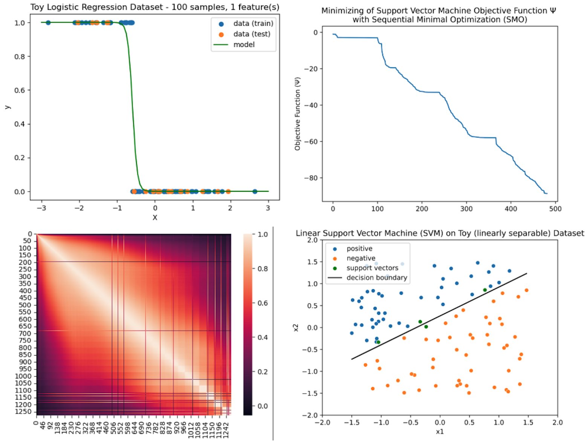

# Intro
Hello! This repo will be a collection of exercises in which I'll implement different classical machine learning algorithms from scratch, and then apply these models to both toy and real-world datasets.

# Why ?
My motivation for doing this is both to deepen my understanding of ML math theory as well as strengthening my python data science skillset. This also helps me gain a better intuition for how to translate academic papers into usable code.

# Practical? Nope.
Would I ever use these models in practice? Definitely not, as my implementations will lack a lot of optimization and extra functionality I could get from scikit-learn. Nevertheless, I feel much more comfortable using such tools when I understand how they work at a deeper level.

# No NumPy someday?
Because my models only use basic matrix operations via NumPy, I would like to eventually write my own low-level replacement (with an identical API) in either C or Rust which I can substitute in, so that this will truly be "from scratch". 

# Building environment
I use conda to manage dependencies. You can build a suitable package environment for this project with:

``
conda create -n models_from_scratch_env --file requirements.txt 
``

Then, activate the environment with:

``
conda activate models_from_scratch_env
``

# Testing
I'll also write unit tests for all models and utility functions using pytest. My basic approach for writing these tests is to define use cases *which I know to be mathematically true* (ex. a singular matrix has a condition number of infinity / Nan), and then check that my code satisfies them. 

Unit tests can be run with:

``
pytest
``

# Project Structure

- `models/`: source code for all models
- `notebooks_and_readmes/`: notebooks applying models to toy and real datasets along with associated READMEs explaining the math/theory/my implementation. 
  - `gaussian_naive_bayes/`: Used gaussian naive bayes model to <u>classify breast cancer as benign vs malignant</u> and <u>credit card charges as fraudulent vs valid</u>
  - `linear_regression/`: linear regression model *and* principal component analysis. Used them together to predict <u> ground state molecular energies based on intermolecular Coulomb repulsion operators</u> 
  - `logistic_regression/`: Used logistic regression model to <u>classify patients as diabetic vs non-diabetic</u>
  - `support_vector_machine/`: Used a linear support vectors machine (implemented with sequential minimal optimization) to <u>detect credit card users at risk of default</u>
- `tests/`: unit tests. Structure of test directories mirrors structure of project as a whole
- `utils/`: extra data and visualization utility functions

