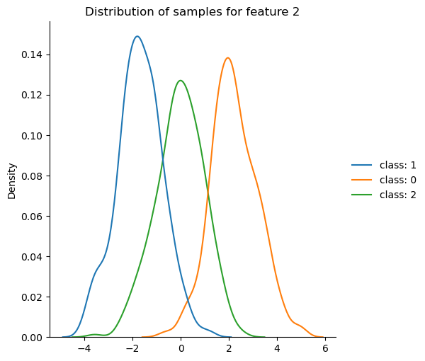

# Gaussian Naive Bayes

Naive bayes is based on Bayes' theorem, which is the following:

$$
P(A|B) = \frac{P(A\cap B)}{P(B)}
$$

The basic principle here and what Bayes' theorem attempts to capture is that in order to obtain the probability of an event A *given that event B has already happened*, we need the ratio of the probability that A *and* B happen against the probability of just B. 

Naive bayes attempts to take this principle and apply it to machine learning by the following relationship:

$$
P(\text{class }|\text{ sample features}) = \frac{P(\text{sample features }\cap\text{ class})}{P(\text{sample features})}
$$

So, to break this down, for the numerator:

$$
P(\text{sample features }\cap\text{ class}) = P(\text{sample features } | \text{ class}) \cdot P(\text{class})
$$

Where $P(\text{class})$ is our "prior" probability. In effect this is the proportion of a given class in the training data.

It's fairly intuitive why a prior is useful here. If we want the probability of a sample having its specified features *and* being in a specific class, and that class represented only 1% of the training data, then the sample's features should have to be more extreme in order for it to have originated from said class in the first place.

Next, for the denominator, we define it as:

$$
P(\text{sample features}) = \sum_{i=1}^{k} P(\text{sample features } | \text{ class}_i) \cdot P(\text{class}_i)
$$

Where k is the number of classes.

We think of the denominator in the same light as Bayes' theorem: it represents the *total* probability of the samples' features being observed, which naturally should be the sum of the probabilities of the sample having its features *and* being in each of the classes present in the dataset. After all, that sum should represent the total of all possible outcomes for a given sample.

Finally, 

$$
P(\text{sample features } | \text{ class}) = \Pi_{i=1}^{d}P(\text{sample feature}_i \text{ }| \text{ class})
$$

Where d is the number of features.

This relationship above is why we call it "naive" bayes; we assume conditional independence of features. 

Now, to top it all off, we have to pick a distribution to assume for the features. As implied by the name, in 'gaussian' naive bayes we assume a normal (aka gaussian) distribution. As a result, we calculate each individual feature probability based on the following:

$$
P(\text{sample feature | class}) = \frac{1}{\sigma\sqrt{2\pi}} \cdot e^{-\frac{1}{2}(\frac{\text{feature} - \mu}{\sigma})^2}
$$

Where $\mu$ and $\sigma$ are the means and standard deviations *for that feature within that specific class*. 

In other words, we want the sample's features to inform how rare it would be for the sample to have originated from a specific class. By assuming a normal distribution of the features, we get the use the formula above to actually calculate how probable the sample's features were (again, for a specific class).

We can visualize what we might want a particular feature's distribution to look like below:

Where we can observe approximately normal distributions of the specific feature, with a clear separation between the classes. 

So, thinking through this, when we fit a gaussian naive bayes model, we need to collect a few different parameters:

-a mean for each feature and class
-a standard deviation for each feature and class
-a prior probability for each class

Thus, if we have k classes and d features, then the total number of parameters that our GNB model needs to store is:

$$
kd + kd + k = 2dk + k = k(2d + 1)
$$

Finally, when we perform a 'forward pass' of this model, we obtain a set of probabilities like:

$$
\set{P(\text{class}_i | \text{sample features}) \text{ }\forall \text{ } i \in [1, 2, ... k] }
$$

In other words, we are left with a list of probabilities that a given sample is in each of the classes that our model recognizes.

So, finally, in order to classify the sample, we just pick the probability which is highest!

# Application to Datasets

You can check out how I've applied [my model](../../models/gaussian_naive_bayes.py) to a [toy dataset](toy_dataset_gaussian_naive_bayes.ipynb), to [classifying breast cancer as benign or malignant](breast_cancer_diagnosis.ipynb), and finally to [classify credit card charges as being fraudulent or not](credit_fraud_detection.ipynb).

Also, I wrote some [unit tests](../../tests/models/test_gaussian_naive_bayes.py) \:)