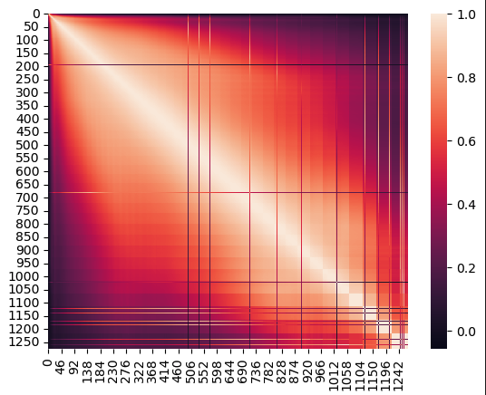
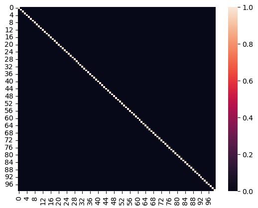

# The Easy One

Okay, I won't write a whole book on linear regression. This one was a lot of fun as I ended up learning a bit about numerical analysis in the process. 

## Linear Regression

The basic idea with linear regression is to create a linear projection of a target vector $y$ onto a feature matrix $X$ which efficiently solves the *least squares regression* problem. In the 2D case (one feature), we often describe this as finding the 'line of best fit'.

We achieve this with the following;

$$
\hat{\beta} = (X^TX)^{-1}X^Ty
$$
 or in python:
`
beta_hat = np.linalg.inv(X_intercept.T @ X_intercept) @ X_intercept.T @ y
`

(X_intercept is X with an extra column filled with ones, explained later)

Where $\hat{\beta}$ is vector filled with approximations of the true coefficients which relate X to y by the following linear function:

$$
\hat{y} = X\hat{\beta}
$$
In code:
`
y_hat = X_intercept @ self.beta_hat
`

Where $\hat{y}$ is a predicted value for $y$

We can also view this in non-linear-algebra language as follows:

$$
\hat{y} = \beta_0 + \beta_1 x_1 + ... + \beta_nx_n
$$

Where x is one particular data sample with n features. Also worth mentioning is that $\beta_0$ is an intercept term, which is incorporated into X via an 'intercept column' (in my case, just a single column filled with ones concatenated with X).

Or, more precisely, we can include a value Ɛ$_i$ which corresponds to the residual (error) for a data sample $x_i$

$$
y_i = \beta_0 + \beta_1 x_1 + ... + \beta_nx_n + Ɛ_i
$$

Finally, we describe the performance of our model via an r-squared term calculated as;

$$
R^2=1-\frac{SSR}{SST}
$$

Where the residual sum of squares (SSR) is effectively the total variation of $y$ about our predictions $\hat{y}$, and total sum of squares (SST) is the total variation in $y$.

$$
SSR = \sum_{i=1}^{N}{(\hat{y_i} - y)^2} \\
SST = \sum_{i=1}^{N}{(y_i - \bar{y})^2}
$$

Where $\bar{y}$ is the mean of $y$. $R^2$ effectively measures the proportion of the variance in $y$ which is explained by $X$, and is in the range [0, 1]. The calculation is intuitive: for an effective linear model, we expect little deviation of $\hat{y}$ from $y$, and thus a very small value for SSR. Therefore, SSR / SST will be small and $R^2$ will approach 1. 

In code:
`y_hat = X_intercept @ self.beta_hat`
`y_mean = y.mean()`
`sum_squares_residual = ((y_hat - y) ** 2).sum()`
`sum_squares_total = ((y - y_mean) ** 2).sum()`
`r_squared = 1 - (sum_squares_residual / sum_squares_total)`

## Matrix Condition

This became important for my specific linear regression, which contains a large number (1275) of highly correlated features.

I'm no expert in numerical analysis but essentially, the idea with a matrix condition is to quantify how *singular* it is. 

For a singular matrix, finding an inverse is impossible. This is problematic for linear regression as our projection relies on matrix inversion:

$$
\hat{\beta} = (X^TX)^{-1}X^Ty
$$

However, a matrix may technically be non-singular, but still *numerically unstable* to invert. Consider the following "almost singular" matrix:

$$
\begin{bmatrix}
0.9999999 & 2\\
1 & 2.0000001
\end{bmatrix}
$$

While this matrix is indeed non-singular and does have an inverse, if you've ever had to do Gauss-Jordan elimination by hand then you'll know that inverting a matrix like this will require you to add, subtract, multiply, and divide by very small and large numbers courtesy of small decimals. This is problematic, as computers have limited numerical precision.

While NumPy won't struggle to find an appropriate inverse for the above matrix, for a sufficiently large "almost singular" matrix, numerical precision error will compound so severely that the resulting "inverse" matrix will not even come close to satisfying:

$$
XX^{-1} = I
$$

Where I is the identity matrix. 

Indeed, this became a problem for my initial "full" model (containing all features), and resulted in a vector for $\hat{\beta}$ with terrible predictive power.

So, a matrix "condition" helps to quantify this instability and singular-ness. 

Its computation is simple. We simply find the eigenvalues $\lambda$, and divide the maximum by the minimum to get the condition number $\kappa$:

$$
\kappa = \frac{\lambda_{max}}{\lambda_{min}}
$$

Thus, a high condition number indicates that a matrix is ill-conditioned, and thus finding and inverse may result in imprecision.

We can roughly quantify this imprecision:

$$
\text{digits of floating-point precision lost} = \log_{10}(\kappa)
$$

Thus, if $\kappa = 10^{8}$, then we expect to lose $\log_{10}(10^8)$ = $8$ digits of precision. 

I find the formula for $\kappa$ to be intuitive. If you understand eigenvectors to be the axes on which $X$ has the most variance, and eigenvalues to be the total variance along their corresponding eigenvector axes, then having a very small eigenvalue suggests that one such axis (or in the case of data, a feature) is unnecessary to adequately explain the matrix (or data). This indicates that one or more features in the matrix may be highly correlated / *almost* linearly dependent amongst each other. 

This will result in a large differential between the maximum and minimum eigenvalues and, consequently, a large condition number. 

## Principal Component Analysis

The motivation behind PCA is to describe a matrix $X$ with a reduced set of features such that we preserve as much of its variance as possible. Imagine we had a dataset filled with measurements taken on different cars, and some of the features we have are weight in grams, weight in pounds, weight in kilograms, weight in tons, weight in AMUs, etc. It's obvious why we only really need one of these to adequately describe the differences between the cars; all of these features would be (perfectly) linearly correlated with each other. 

Thus, PCA can be thought of as a one-size-fits-all approach for decomposing a dataset into a reduced set of combinatorial features which contain all the information we need to describe the dataset and, consequently, use it to make predictions. 

I won't go through all the math of this, but what we end up doing is computing eigenvectors and eigenvalues for the covariance matrix of $X$, selecting eigenvectors with the greatest eigenvalues (thus indicating they are axes which capture the largest proportion of the variance in X). These eigenvectors become our *principal components*. We then project X onto the principal component space, producing $X_{reduced}$.

## Predicting Ground-State Molecular Energy

I attempted to reproduce results from the dataset used in [this paper](https://arxiv.org/pdf/1609.07124) using linear regression. The dataset in question is a collection of 16242 organic molecules and their simulated ground-state energies, which is the free energy in the molecule when no other exciting force is applied (for example, a photon). As features, each molecule contains 1275 values corresponding to the intermolecular Coulomb repulsion operators, which quantify the repulsion between each pair of atoms in each molecule. 

As I mentioned before, my initial attempt to fit a full linear model to this dataset was unsuccessful. If we take a look at the linear correlations between features, we can see why:

We can visually see a high degree of multicollinearity between our 1275 features. As a result, the matrix $X^TX$ is "almost singular", having a condition number of 1.395e+16. Remembering our equation from before, this indicates that we expect to lose around 16 digits of precision when computing an inverse. The result is a $\hat{\beta}$ vector that is highly inaccurate.

After performing PCA and selecting the 100 best principal components, we can visualize our new correlations for $X_{reduced}$, which has 100 features:

As you can see, our new features are linearly independent (more specifically, they are orthogonal). This suggests that $X_{reduced}$ is an efficient representation of $X$. 

Finally, I fit a linear model to an 80% training set of $X_{reduced}$ and achieved an $R^2$ of 0.954 on the 20% test set.