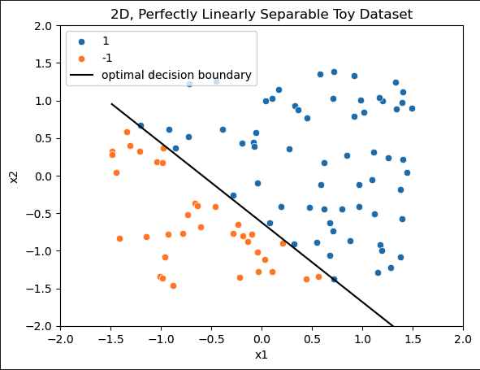
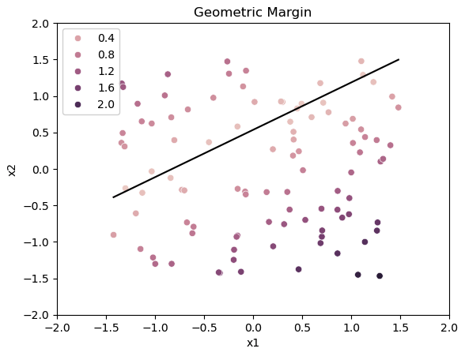
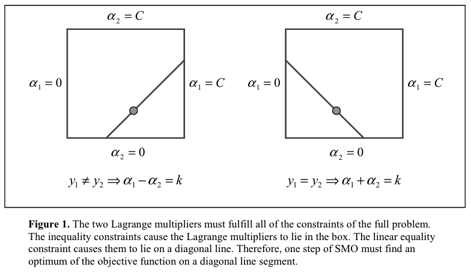
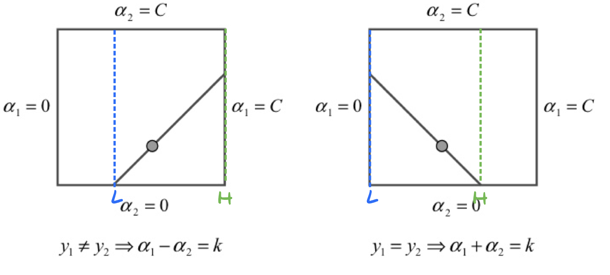
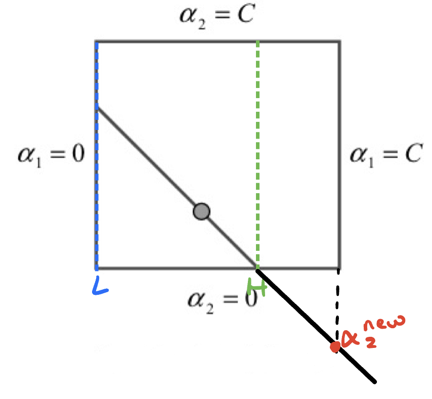
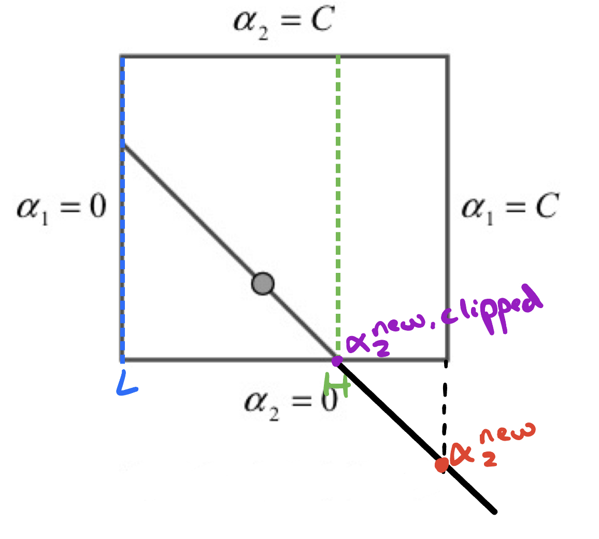
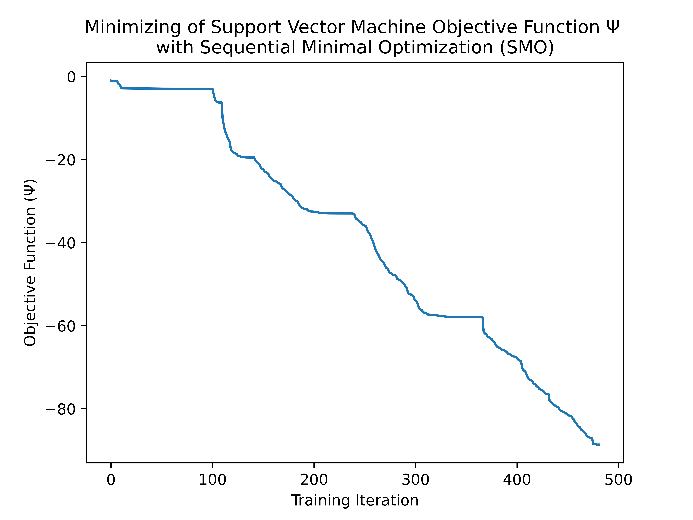
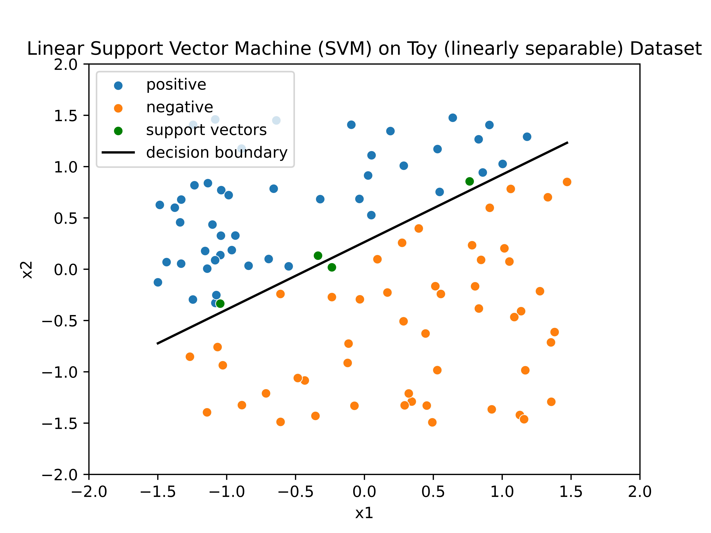
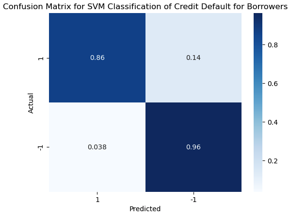

# Note

For some reason, github seems to not display my LATEX correctly. If the same is happening for anyone reading this, I've included a PDF version which you can view by [clicking here](README_svm.pdf).

# Building a Support Vector Machine From Scratch
Okay, so this one turned out to be much, much trickier than I had anticipated. I'll give a somewhat high-level explanation of the math behind support vector machines and the logic of sequential minimal optimization. Then, I'll go through how I applied it to a real classification problem. 

The basic motivation behind SVMs (for classification) is to find some decision boundary that separates two (or more) classes in a dataset. An example of a perfectly linearly separable dataset with two features is given:

Where the classes are -1 and 1 and the 'optimal decision boundary' is what we'd like a model to find, somehow.

In this case, the model could simply be a linear function of x1 and x2 defined by:

$$
x = [x_1, x_2]\\
w = [w_1, w_2]\\
\hat{y} = g(x \cdot w + b)
$$

Where w and b are learnable parameters and $g$ is a sign function that gives us either 1 or -1 as a prediction depending on if its contents are greater or less than 0, respectively. 

The way we formulate this optimization problem is one of margin maximization. What this effectively means is that we want to not just find the decision surface / hyperplane that separates our dataset into classes, but also the one that maximizes this separation or 'margin'. 

This is contrasted with logistic regression, for example, where we compute cross entropy loss (which effectively compares the true vs predicted distribution) and attempt to minimize it using some variant of gradient descent.

This results in a much different optimization problem, and requires some clever mathematical reformulations to give an objective function which is convex.

In the linear case, we can define our objective and its contraints as follows:

$$
\text{max}_{\gamma, w, b}\text{ } \gamma \\
\text{s.t.}\;\; y_i(x_iw + b) \geq \gamma \; \forall \; i \in [1, ... \: m] \\
||w|| = 1
$$

Where $\gamma$ is the *geometric margin* of our model with respect to our dataset. The geometric margin is basically a normalized measurment of the distance between our decision boundary and all of the points in our dataset. 

We can visualize the geometric margin for another toy dataset below:

As you can see, points which are farther away from the theoretical optimal decision boundary (black line) have a higher geometric margin.

Also, when we say the geometric margin *with respect to our dataset*, this is referring to the *smallest* value. 

So, the basic intuition is as follows: we want our *smallest* geometric margin value to be *as big as possible*, because this suggests our decision boundary is maximally separating the classes in our dataset. 

Finally, it's important to understand that the geometric margin is calculated as:

$$
\frac{y_i(x_iw + b)}{||w||}
$$

And thus by constraining $||w||$ to be 1, the geometric margin values are recovered.

So, going back to our objective function and constraints:

$$
\text{max}_{\gamma, w, b}\text{ } \gamma \\
\text{s.t.}\;\; y_i(x_iw + b) \geq \gamma \; \forall \; i \in [1, ... \: N] \\
||w|| = 1
$$

We can read that what this is really saying is that we want to *maximize* the *minimum* geometric margin ($\text{max}_{\gamma, w, b}\text{ } \gamma$) such that all the other geometric margins are greater ($\text{s.t.}\;\; y_i(x_iw + b) \geq \gamma \; \forall \; i \in [1, ... \: m]$) with the added constraint that the norm of our weights is 1 ($||w|| = 1$), ensuring that $y_i(x_iw + b)$ is, indeed, the geometric margin (and not its non-normalized variant called the 'functional margin').

Ok, got it? Great, because we can't actually use that formulation in to optimize the parameters of our model \:)

## The Lagrangian

Instead, we need to reformulate this into a *Lagrangian*, which is a neat trick that helps us solve constrained optimization problems by treating constraints as a component of our objective.

I'm skipping quite a few steps here, but the objective function and constraints we defined above end up being translated as follows:

$$
\text{min}\Psi(\alpha) = \text{min}\frac{1}{2}\sum^{N}_{i=1}\sum^{N}_{j=1}{y_iy_jK(x_i, x_j)\alpha_i\alpha_j} - \sum^{N}_{i=1}{\alpha_i}\\
\text{s.t.} \;0\leq \alpha_i \leq C \; \forall \; i \in [1, ... \: N] \\
\sum_{i=1}^{N}{\alpha_iy_i} = 0
$$

Where our objective function is $\Psi$.

So, there's a lot to unpack there. 

The $\alpha$'s are our lagrange multipliers, and we have one for each data sample. In this restatement of the problem, we now have a vector $\alpha$ and a bias term $b$ as our parameters as opposed to $w$ and $b$. 

## Kernel Functions and SVMs as Sample Comparators rather than Decision Boundaries
$K(x_i, x_j)$ is our kernel function, which is used to compare the similarity of data samples to each other. This is an important point about SVMs: the way I displayed it before in which the model is a hyperplane that separates data points is somewhat misleading. While the model can be rewritten to work this way, an SVM fundamentally makes predictions by *comparing data samples to each other*. 

So, this function I showed before to evaluate an SVM on a new data sample $x$:

$$
\hat{y} = g(x \cdot w + b)
$$

Really looks like this when using our new Lagrangian definition:

$$
u = (\sum_{j=1}^{N}{y_j\alpha_jK(x_j, x)}) + b\\
\hat{y} = g(u)
$$

The reason why this distinction is important is because those two definitions are only equivalent when we have a linear kernel, i.e. a dot product: 

$$
K(x_i, x_j) = x_i \cdot x_j
$$

However, we can define an arbitrary number of kernel functions. This is useful because unlike the toy dataset I showed before, some datasets require a more complex, non-linear decision boundary in order to effectively perform classification. 

As an example, one popular kernel function is the gaussian kernel or radial basis function:

$$
K(x_i, x_j) = \text{exp}(-\frac{||x_i - x_j||^2}{2\sigma^2})
$$

Which measures the distance between samples with $\sigma$ as a 'bandwidth parameter' that allows for a more complex boundary when small.

To gain an intuition for this way of thinking about SVMs, whereby predictions are made by comparing data samples, I'll pose a scenario:

Imagine there are 100 people in a room, half of which are men and the other half women. Now, let's say that all men are taller than 6' and all women are shorter than 5' 10". Then, a new person walks in the room, wearing a costume such that you can't tell their gender. Now, we want to make a reasonable classification of whether they are a man or woman. What you *could* do is measure their height and predict that they are a man or a woman depending on whether they are taller than 6' or shorter than 5'10", respectively. However, you could also identify *support vectors*, which are data samples that are closest to the decision boundary. In this case, these would be the man who is 6.00001 feet tall and the woman who is 5' and 9.99999 inches. In other words, the most woman-like man and the most man-like woman. Then, simply classify the mystery man/woman based on whether they are taller or shorter than the support vectors. 

Now, this illustrates a couple important points about SVMs. First, it should give you a sense for why this sample-sample comparison way of thinking about SVMs is indeed equivalent to a decision boundary *for linear kernels*. However, what if we wanted to measure the similarity between our new data sample and our support vectors in a different way (perhaps a gaussian kernel)? In this case, we would need to remember who the support vectors were. Indeed, SVMs with non-linear kernels must store their support vectors, their target (class), and associated lagrange multipliers in order to make predictions on new data samples.

## Valid vs Invalid Kernels

The only real constraint on what we can use as a kernel function is that we need the resulting kernel matrix (which is filled with every possible sample-sample kernel evaluation for a given dataset) to be symmetric and positive semi-definite. 

What this ultimately means is that we should be able to switch the order of the two samples we pass into the kernel function and get the same result:

$$
K(x_i, x_j) = K(x_j, x_i)
$$

It's obvious why this needs to be true: if SVMs are really all about making comparisons between data points, and the kernel function is how we make that comparison, then we need to be able to swap the order in which we pass samples to the function in order for it to be a reasonable measure of similarity. If you're trying to decide which car to buy out of two favorites, then your answer really shouldn't be influenced by which one you test-drove first. 

An example of an invalid kernel function would be

$$
K(x_i, x_j) = (2 \cdot x_i) \cdot x_j
$$

because we'll get a different output by switching $x_i$ and $x_j$. 

This is what is meant by the 'kernel trick' of SVMs: as long as our kernel function satisfies those criteria, we can treat it like all other SVMs and, most importantly, optimize it the same way. 

## alpha in [0, C]

Now, for the first constraint:

$$
\;0\leq \alpha_i \leq C \; \forall \; i \in [1, ... \: N] 
$$

In this case, it's useful to conceptualize the lagrange multipliers ($\alpha_i$) as representing *how much of an effect* a data sample has on our model's predictions. Why? Well, if we go back to our Lagrangian version of evaluating an SVM on a new data sample $x$:

$$
u = (\sum_{j=1}^{N}{y_j\alpha_jK(x_j, x)}) + b\\
\hat{y} = g(u)
$$

We can see that when a particular sample $x_j$ we're comparing to has a large $\alpha_j$, it will have a large effect on $u$, which we use to make a classification. By contrast, if an $x_j$'s corresponding $\alpha_j$ is 0, then it has no effect on any prediction whatsoever. This is what makes a data sample a **support vector**: a **nonzero lagrange multiplier**.

Also, we can see that our lagrange multipliers are constrained to a maximum value $C$. We can think of this as the *maximum* effect that a data sample can have on our predictions (and thus decision boundary). This is important in cases where classes are not (linearly or otherwise) separable, and a low $C$ permits a 'softer' margin with some misclassifications. 

## $\alpha \cdot y = 0 $ and why optimizing SVMs is tricky

Finally, the second constraint:

$$
\sum_{i=1}^{N}{\alpha_iy_i} =0
$$

(Note that $\sum_{i=1}^{N}{\alpha_iy_i}$ is just the dot product of the vector $\alpha$ with $y$)

I'm not sure how to intuitively explain what this constraint means, but it is nonetheless central to the way we train SVMs.

Why? Well, consider our objective function:

$$
\text{min}\Psi(\alpha) = \text{min}\frac{1}{2}\sum^{N}_{i=1}\sum^{N}_{j=1}{y_iy_jK(x_i, x_j)\alpha_i\alpha_j} - \sum^{N}_{i=1}{\alpha_i}\\
$$

Where $\alpha$ is a set of lagrange multipliers $[\alpha_1, \alpha_2 ... \alpha_N]$. 

If we want to minimize this function, we could follow the same logic used in, say, gradient descent, where we take the partial derivative of our objective with respect to each parameter:

$$
\frac{\delta\Psi}{\delta\alpha_i} \; \forall \; i \in [1, ... \: N] 
$$

Then, we could simply take iterative steps to minimize the objective function using a predetermined learning rate:

$$
\alpha_{i, \: new} = \alpha_i - \text{lr}\cdot \frac{\delta\Psi}{\delta\alpha_i} \; \forall \; i \in [1, ... \: N]
$$

However, this introduces a problem:

How do we ensure that 

$$
\sum_{i=1}^{N}{\alpha_iy_i} = 0
$$

is satisfied at each gradient descent step? Moreover, how do we ensure each $\alpha$ satisfies $\;0\leq \alpha_i \leq C \; \forall \; i \in [1, ... \: N] $?

Well we can't, at least not with a simple GD approach where we get to optimize all of our parameters at each training step. In our case, each lagrange multiplier is dependent on all other lagrange multipliers, and can be solved for as follows by rearranging the second constraint:

$$
\sum_{i=1}^{N}{\alpha_iy_i} = 0 \\
\alpha_1y_1 = -\sum^{N}_{i=2}{\alpha_iy_i}\\
\alpha_1y_1\cdot y_1 = y_1 \cdot (-\sum^{N}_{i=2}{\alpha_iy_i})\\
\alpha_1 = -y_1\sum^{N}_{i=2}{\alpha_iy_i}
$$

(Side note: the reason why we can move $y_1$ to the other side by multiplying both sides by $y_1$ is because every y value is either -1 or 1, so $y_i^2$ is always 1)

What this means is that we don't have the same freedom in how we adjust our model's parameters as we do when performing logistic regression or when training a neural network, as we can't blindly adjust all of the $\alpha$ at the same time, *nor* can we simply pick one to optimize and keep the others fixed (since we are by definition required to change multiple simultaneously). 

## Sequential minimal optimization: two at a time

The solution to this problem as described by John Platt in [Sequential Minimal Optimization: A Fast Algorithm for Training Support Vector Machines](https://www.microsoft.com/en-us/research/uploads/prod/1998/04/sequential-minimal-optimization.pdf) is to minimize our objective by altering lagrange multipliers in *pairs*.

The basic idea is that we select a pair of lagrange multipliers $\alpha_1$ and $\alpha_2$ and optimize them together while holding all other $\alpha$ constant. To start, we should consider that they depend on each other; any change we make to $\alpha_1$ must also be made to $\alpha_2$ in order to satisfy $\sum_{i=1}^{N}{\alpha_iy_i} = 0$

Thus,

$$
\alpha_1y_1 + \alpha_2y_2 = -\sum_{i=3}^N{\alpha_iy_i}
$$

Because we're choosing to hold all other $\alpha \in [3, 4, ... \; N]$ constant, we can see that $-\sum_{i=3}^N{\alpha_iy_i}$ is also just a constant. In some papers this term is denoted as zeta ($\zeta$):

$$
\alpha_1y_1 + \alpha_2y_2 = \zeta
$$

Furthermore, when making changes to $\alpha_1$ and $\alpha_2$ we need to continually satisfy $\;0\leq \alpha_i \leq C \; \forall \; i \in [1, ... \: N] $.

When trying to optimize our pair of $\alpha$, we can think of all of their possible values as falling on the line defined by $\alpha_1y_1 + \alpha_2y_2 = \zeta$, which itself is constrained by the box $[0, C]$.

This is a helpful visualization provided by Platt, where $k$ corresponds to our $\zeta$ term:

Now the basic process for SMO is that we start by optimizing the objective $\Psi$ with respect to $\alpha_2$, ensure it satisfies our two major constraints associated with $\Psi$, and then obtain $\alpha_1$ from our new $\alpha_2$, which, again, we can do because all of our lagrange multipliers are constrained to each other by $\sum_{i=1}^{N}{\alpha_iy_i} = 0$

So, we start by minimizing $\Psi$ with respect to $\alpha_2$. Doing this requires the **Newton-Raphson** method, which allows us to approximate the zeros/roots of a function using its derivative. [This blog post](https://medium.com/@sciroad/optimization-1-introduction-to-optimization-and-bisection-and-newton-raphson-methods-abf73796fea4) gives a great explanation / visualization of what Newton-Raphson does. In this case, we're using the derivative of $\Psi$ w.r.t. $\alpha_2$ as our function, and thus by approximating its zero we also approximate a critical value of $\alpha_2$ (in this case a minimum for $\Psi$). 

$$
\alpha_2^{new} = \alpha_2 + \frac{y_2(E_1 - E_2)}{\eta}
$$

Where E is the error:

$$
E_i = u_i - y_i
$$

and eta ($\eta$) is the second derivative of $\Psi$ with respect to $\alpha_2$ along the line $\alpha_1y_1 + \alpha_2y_2 = \zeta$ defined by:

$$
\frac{\delta^2\Psi}{\delta\alpha_2^2} = \eta = K(x_1, x_1) + K(x_2, x_2) - 2K(x_1, x_2)
$$

Next, we need to make sure that our new $\alpha_2$ falls inside the box we saw earlier. If it doesn't, then we need to clip it. We do this by creating a pair of min / max values, which we'll call L and H. We can visualize L and H on the boxes from before:

Also interesting to consider is the fact that L and H will be dependent on both $\alpha_1$ and $\alpha_2$. Below, we can see a case where, although $\alpha_2$ is in $[0, C]$, the corresponding $\alpha_1$ is not, despite both residing on the line $\alpha_1y_1 + \alpha_2y_2 = \zeta$. 

We can obtain L and H as follows:

$$
L = \begin{cases} 
max(0, \alpha_2-\alpha_1) & \text{if } y_1 \neq y_2 \\
max(0, \alpha_2+\alpha_1-C) & \text{if } y_1 = y_2 \\
\end{cases} \\
\;\\
H = \begin{cases}
min(C, C + \alpha_2-\alpha_1) & \text{if } y_1 \neq y_2 \\
min(C, \alpha_2+\alpha_1) & \text{if } y_1 = y_2 \\
\end{cases}
$$

If you can visualize the diagonal lines from the box plots in different positions and the resulting change to L and H, then I find these statements to be pretty intuitive.

So, with all that said, our full process for obtaining an updated $\alpha_2$ is the following:

$$
\alpha_2^{new, \;clipped} = \begin{cases}
 L & \text{if } \alpha_2^{new} < L \\
 \alpha_2^{new} & \text{if } L \leq \alpha_2^{new} \leq H \\
 H & \text{if } \alpha_2^{new} > H
\end{cases}
$$

Going back to the most recent example on the box graph, we can see the effect of clipping in a case where $\alpha_2^{new} > H$:

Now we can obtain our $\alpha_1^{new}$ from $\alpha_2^{new, \;clipped}$.

We could simply rearrange $\alpha_1y_1 + \alpha_2y_2 = \zeta$ with our new lagrange multipliers subbed in:

$$
\alpha_1^{new}y_1 + \alpha_2^{new, \;clipped}y_2 = \zeta \\
\alpha_1^{new}y_1 = \zeta - \alpha_2^{new, \;clipped}y_2 \\
\alpha_1^{new} = (\zeta - \alpha_2^{new, \;clipped}y_2) \cdot y_1
$$

Then substituting in $\alpha_1y_1 + \alpha_2y_2$ for $\zeta$:

$$
\alpha_1^{new} = (\alpha_1y_1 + \alpha_2y_2 - \alpha_2^{new, \;clipped}y_2) \cdot y_1 \\
\alpha_1^{new} = \alpha_1y_1y_1 + \alpha_2y_2y_1 - \alpha_2^{new, \;clipped}y_2y_1 \\
\alpha_1^{new} = \alpha_1 + y_2y_1 \cdot (\alpha_2 - \alpha_2^{new, \;clipped})
$$

(Recall that $y_i^2$ is always 1)

Finally, Platt chooses to represent $y_1y_2$ as $s$, giving us the final formula for $\alpha_1^{new}$:

$$
\alpha_1^{new} = \alpha_1 + s \cdot (\alpha_2 - \alpha_2^{new, \;clipped})
$$

And there we have it: a fully analytical way of solving for an optimized value of $\alpha_2$ and a complementary value of $\alpha_1$. To reiterate, our process works like this:

1. Find a value of $\alpha_2^{new}$ which minimizes the objective function $\Psi$
2. Clip $\alpha_2^{new}$ such that neither $\alpha_2$ nor the resulting $\alpha_1$ lie outside $[0, C]$
3. Compute $\alpha_1^{new}$ from $\alpha_2^{new, \; clipped}$

## Karush-Kuhn-Tucker and Selecting $\alpha_1$ and $\alpha_2$

Now, how do we select $\alpha_1$ and $\alpha_2$ to ensure that we maximize our progress at each step? For this, we'll need to discuss the Karush-Kuhn-Tucker (KKT) conditions. 

At a high level, the goal of KKT is to generalize the following statement:

$$
\nabla\Psi(\alpha) = 0
$$

If we've reached a point where the gradiet of the objective function of $\alpha$ is 0, then we can assume we've reached an optimal set of lagrange mulipliers with a global minimum for $\Psi$.

The KKT conditions for SVM look like:

$$
\alpha = 0 \Rightarrow u \cdot y \geq 1 \\
0 < \alpha < C \Rightarrow u \cdot y = 1 \\
\alpha = C \Rightarrow u \cdot y \leq 1 
$$

Where the SVM is considered to have converged when these conditions are satisfied for all $\alpha$. The conditions are checked within a tolerance Ɛ, which is recommened to be $10^{-3}$ or $10^{-4}$, 

For SVMs, the KKT conditions double as both a stopping condition and as a crucial component of the heuristic used to select $\alpha_1$ and $\alpha_2$. 

For SMO, there are two separate heuristics; one for $\alpha_1$ and the other for $\alpha_2$

### Selecting $\alpha_1$

For the first heuristic, SMO always chooses samples which violate KKT. Moreover, it alternates between making a *single pass over all samples violating KKT* and *multiple passes over samples whose $\alpha$ are not at the bounds (0 or C) and which violate KKT*. 

Platt's reasoning for this is that, in pursuit of all samples obeying KKT, it is reasonable to expect that $\alpha$ values which are "at the bounds are likely to stay at the bounds". 

What this means in pratice is that samples which are not support vectors ($\alpha =0$) or those which are misclassified / in the margin ($\alpha = C$) generally do not end up in $(0, C)$ as SMO progresses. Thus, the main portion of SMO focuses on adjusting the relative importance of existing support vectors. 

### Selecting $\alpha_2$

Where the selection of $\alpha_1$ was based on the KKT conditions, SMO's choice of $\alpha_2$ is purely based on maximizing the step size.

This can be done efficiently by keeping a cache of error values $E$

$$
E = u - y
$$

Then, we select $\alpha_2$ according to the following:

$$
\alpha_2 = 
\begin{cases} 
\alpha[\argmax_{i} E] & \text{if} \; \alpha_1 \leq 0 \\
\alpha[\argmin_{i} E] & \text{if} \; \alpha_1 > 0
\end{cases}
$$

What this means is that if $E_1$ is positive, we pick $\alpha_2$ to have the minimum $E_2$, whereas if $E_1$ is negative we want the maximum $E_2$. Platt's reasoning for this heuristic is that we can approximate the step size as

$$
|E_1 - E_2|
$$

rather than by fully evaluating $\Psi$, which, if we take a look again:

$$
\text{min}\Psi(\alpha) = \text{min}\frac{1}{2}\sum^{N}_{i=1}\sum^{N}_{j=1}{y_iy_jK(x_i, x_j)\alpha_i\alpha_j} - \sum^{N}_{i=1}{\alpha_i}\\
$$

Necessarily requires that we evaluate the kernel function $K$ for all pairs of samples $x_i$ and $x_j$. In other words, this is an $O(N^2)$ problem that we don't want to deal with at every training iteration of SMO. 

## Applying it to a toy dataset

Ok, now for the fun part: applying the model to data. [My implementation uses NumPy and fits into ~350 lines of (not very compact) python](../../models/support_vector_machine.py).

On a toy dataset, we can view the progression and final result of SMO:

We can see the model converged at just under 500 iterations, meaning KKT was satisfied for all samples.

Additionally, I've marked all samples with non-zero lagrange multipliers as support vectors (green). You'll notice they are the closest to the decision boundary, which, if you'll remember from before, is because they actually *define* the hyperplane (and not the other way around). 

You can view the IPython notebook [here](toy_datasets_svm.ipynb).

## Classifying Credit Default Risk

Finally, I applied my model to a real-world dataset predicting credit card users' risk of defaulting based on their age, income, loan amount, and loan-to-income ratio. It's a little hard to represent this model visually, so I'll just say that with a train/test split of 80/20, my model matched the performance of scikit-learn and achieved a test accuracy of 94.75%. You can check out the notebook [here](credit_default_classification.ipynb). Also, I did construct a confusion matrix, which helps to show that the model correctly classifies both classes

Also, I wanted to make a note of this: When trying to model this dataset, I encountered severe underperformance initially. I tried varying C and the number of training iterations, but nothing seemed to work. It took a lot of plotting and stepping through my code with a debugger to realize the issue.

Remember how SVMs are all about comparing sample similarity based on a kernel function? Well, consider a linear kernel:

$$
K(x_1, x_2) = x_1 \cdot x_2
$$

Where we simply use a dot product to calculate similarity. In this case, **it is essential to normalize our features** to ensure we don't unwittingly place extra importance on a feature with a higher mean value. In my case, I chose to use min-max normalization,

$$
x_{scaled} = \frac{x-x_{min}}{x_{max}-x_{min}}
$$

which scales all features to the range $[0, 1]$. Note that the min/max values should be obtained from the training set to avoid data leakage. 

## The End
This write-up is mostly based on [Andrew Ng's lecture notes on support vector machines](https://see.stanford.edu/materials/aimlcs229/cs229-notes3.pdf) and the [original SMO paper by John Platt](https://www.microsoft.com/en-us/research/uploads/prod/1998/04/sequential-minimal-optimization.pdf). There are a few details about SVMs that I didn't go into detail about such as the derivation of the lagrangian form, handling $\eta < 0$, and how to re-compute $b$ and $w$. If you're interested in learning more, I'd recommend taking a look at their work. 

Thanks for reading!

Christian G. 

